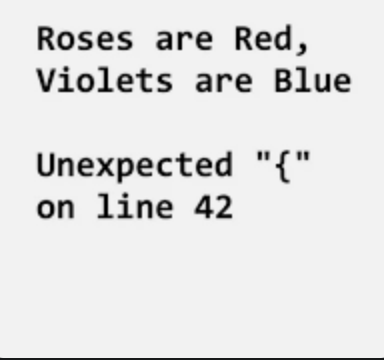
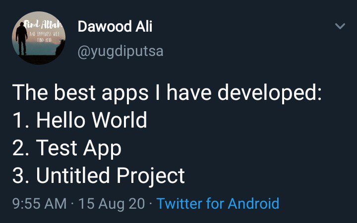

# Level 00 A

---

## What is Computer Science? 💻👨‍🔬

Why is this field of study called "Computer Science" and not "Program Writing" or "Code Mathematics"? It's because coding requires research and experimentation! You'll often need to test your programs to learn from unexpected errors, and then make changes to get the results you want.

---

These lessons will teach you how to code in C#, which is a modern and versatile programming language!

C# is used by the Unity game engine, which is used to make video games for computers, consoles, and mobile devices. C# is also used to make web applications, desktop applications, and even to program robots!

Learning to code isn't what programming is all about, you'll also learn how to think like a programmer!

---

## What is QuintOS? 👾

If you signed up for this course you might want to know how video games work and how to make your own! If not, making games will hopefully be a fun way for you to learn how to code.

Issac Newton, a famous 17th century scientist, once said, "we stand on the shoulders of giants". Newton was humbly acknowledging that great advancements made by people in his day were built upon a giant foundation laid by our ancestors. To become a software developer today it's good to learn a bit about the history of computers and computer games.

---

QuintOS contains a set of retro computer simulations. During each lesson you'll develop a game that runs on a virtual computer displayed in the Google Chrome web browser. As you level up your coding skills, the virtual computer will get upgraded too. Since you're just starting out, the first game you make will be for... a programmable calculator. 😜

---

This first lesson will require you to learn a lot of information before we can even make a simple game. It may be a bit overwhelming for you but don't worry! You'll get a lot of practice with these concepts so that you will fully understand them. Let's get started! 🥳

---

## Creating Variables 🔡

First of all, what is a variable? Variables in C# store data in your computer's memory.

```csharp
int a = 0;
```

Use data type declarations like int to create variables. In the example code a is the name of the variable. a is assigned the number 0.

Semicolons ; are required to end each line of code. 👁👅👁

---

## Types of Data 💾

In C# variables are created using specific data types, depending on the type of data they store.

---

### int and float 🔢

Numbers in C# can be stored as `int` for integers (whole numbers) or `float` for floating-point (decimal) numbers.

```csharp
int x = 2;
int y = -49;
float z = 9504.15f;
```

---

### bool ✅

Booleans can either be `true` or `false`

```csharp
bool codingIsFun = true;
```

---

### char 🅰️

Characters are single letters or symbols, contained within 'single quotes'.

```csharp
char letterA = 'A';
```

---

### string 💬

Strings are text data, contained within "quotes".

```csharp
string story = "I took my dog to the dog park on 3rd Avenue.";
```

ERROR! If you don't use quotes, C# will think the words are variables!

```csharp
string story = I took my dog to the dog park on 3rd Avenue.;
```

To remember that the data type for text is called String, you can think of lettered beads on a charm bracelet string.

---

### functions ⚙️

functions are a reference to other sections of code which you can run using `()` parenthesis. Input parameters to a function go in the parenthesis.

```csharp
powerOn();
turn('left');
moveForward(10);
turn('right');
moveForward(2);
```

This code for a robot remote control makes the robot power on, turn left, move forward ten steps, turn right, and then move forward two steps. Note that functions can do different things depending on their input values!

---

## Globals 🌐

Globals are special variables and functions that are available for you to use anywhere in your code.

---

## User input ❔

Check out the `Console.WriteLine` and `Console.ReadLine` functions for user interaction.

The `Console.WriteLine` function is used to show the user a message. The `Console.ReadLine` functions is used to get user input, such as an answer to a question.

```csharp
Console.WriteLine("What is your favorite color?");
string favColor = Console.ReadLine();
// the user's response to the prompt is assigned to favColor

Console.WriteLine(favColor + " is my favorite too!");
```

In this example the program will wait for the user to type their favorite color and press enter before continuing.

---

## Comments 📝

Double slash `//` is for making a comment, any text behind it on the same line will not be considered part of the code's instructions. Comments are used to describe what is happening in the code. You might want to make comments so other people can understand your programs or so that you can understand it yourself in case you forget what you did.

---

## Convert string to int

Note that `Console.ReadLine` returns a `string`. You can convert a `string` to an `int` using the `int.Parse` function.

```csharp
int myNumber = int.Parse(Console.ReadLine());
```

---

## End of Level 00 A

Now you're ready to start making your first game! 🥳 [Click here for the GuessTheNumber instructions.](https://github.com/quinton-ashley/IntroToCSharp/blob/main/Level_00/GuessTheNumber.md)

---

# Level 00 B

Did you complete `GuessTheNumber` part A and are ready to learn more? Before we can finish the game we have to learn a bit more stuff.

---

## Pascal and Camel Case 🐫

Variable names in C# can't have spaces, 🙅‍♂️ so for variables that have multiple words, use camel case! Capitalize the first letter of the words after the first word.

```csharp
string apple = "🍎";
string applePie = "🍎 π";
string applePieIceCream = "🍎 π 🍨";
```

Classes (like Console) and methods (like ReadLine) use Pascal case! Capitalize the first letter of each word.

```csharp
string choice = Console.ReadLine();
```

Note that using this naming convention isn't required for C# to run, it's just something that most professional C# programmers do to make variable names easier to read. These naming convention specific to C#, other programming languages have their own conventions.

---

## Checking Equivalence ✅

Single equals `=` is for assigning values to variables. Double equals `==` is a boolean operator used for checking equivalence. What is a boolean operator? It performs an operation that results in either a true or false (boolean) value.

---

## if/else statements

`if` statements use a boolean condition, which goes in parenthesis after the keyword `if`. If the boolean condition is `true`, the code block `{}`, whatever's inside the squiggly brackets, is run.

---

Check out this coin toss example code. Coin tosses are used in many sports to decide which of two teams goes first. One team picks which side of the coin they think will land facing up, "heads" or "tails". Imagine the `coinFlip` variable was set to either "heads" or "tails" randomly before the example excerpt below.

```csharp
Console.WriteLine("Heads or tails?");
string pick = Console.ReadLine();

if (coinFlip == pick) {
	Console.WriteLine("You won the coin toss!");
} else {
	Console.WriteLine("You lost the coin toss!");
}
```

---

## else if chaining

`else if` can be used after if statements, they form a chain of different paths the code can take if the previous if statements were false.

---

Take a look at the example below, which assigns a color to the variable `fruitColor` based on the name of the `fruit`.

```csharp
Console.WriteLine("What's your favorite fruit?");
string fruit = Console.ReadLine();

string fruitColor; // variables can be created without a value assigned to them

// if the fruit is a banana
if (fruit == "banana") {
	// set the fruitColor to yellow
	fruitColor = "yellow";
} else if (fruit == "pear") {
	// else if the fruit is a pear, set the fruitColor to green
	fruitColor = "green";
} else if (fruit == "orange") {
	fruitColor = "orange";
} else if (fruit == "grape") {
	fruitColor = "purple";
} else {
	// else the fruit was not a banana, pear, orange, or grape
	// the fruitColor is unknown
	fruitColor = "unknown";
}

Console.WriteLine("The color of a " + fruit + " is " + fruitColor);
```

What color will be assigned to `fruitColor` if the `fruit` is a pear? What if the fruit is a strawberry?

---

## Boolean operators 🐰

```txt
Equivalence:              ==
Not equals:               !=
Less than:                <
Less than or equal to:    <=
Greater than:             >
Greater than or equal to: >=
```

Boolean operations evaluate to either true or false. Use them in the boolean conditions (inside the parenthesis) of `if` and `else if` statements.

---

# Level 00 C

---

## Changing a variable's value

Don't create variables twice!

```csharp
string x = 10;
string x = 5; // ERROR! x already exists
```

Here's how to change the value of the variable `x`

```csharp
string x = 10;
x = 5; // good :)
```

---

## Code Execution Order

Note that you can not use a variable before you create it. You will get an error saying the variable is not defined, meaning that C# doesn't have a variable with that name in its memory.

```csharp
Console.WriteLine(message); // ERROR: message is not defined
string message = "Hi";
```

Create variables before you use them.

```csharp
string message = "Hi!";
Console.WriteLine(message); // good!
```

---

## Scopes

Note that if you declare a variable in a code block it will only be available from the beginning to the end of the block. This is called the scope of a variable. The code block/scope begins with this opening squiggly bracket (aka curly brace) `{` and ends with a closing squiggly bracket `}`

```csharp
if (name == "Bob") {
	string message = "Hi Bob!";
}

Console.WriteLine(message); // ERROR: message is not defined
```

---

Fix this by initializing `message` outside of the if statement.

```csharp
string message;
if (name == "Bob") {
	message = "Hi Bob!";
}

Console.WriteLine(message); // good!
```

---

Also remember to finish every scope you start! Every opening brace `{` needs a closing brace `}`.



---

## while loops

Need to loop some code? Use a while loop! `if` statements run the code in their code block once if their boolean condition is true. `while` loops repeat the code in their code block as long as their boolean condition _remains_ true.

Take a look at the following example. Imagine that the `deck.PickACard` function returns a String with the name of the card taken from the top of the deck, such as "Two of Hearts" or "Nine of Clubs".

```csharp
string card; // no card picked yet

while (card != "Ace of Spades") {
	card = deck.PickACard();
}

Console.WriteLine("Found the Ace of Spades!");
```

---

# Level 00 D

---

## Mathematical operators 🔢

```txt
Addition:       +
Subtraction:    -
Multiplication: *
Division:       /
```

The multiplication symbol is the asterisk, NOT the letter `x`!

```csharp
int x = 5 * 8; // x -> 40
```

---

## Math: Generate a random number

Use the `Random` class to get a random decimal number. You can specify the range using the `Next` function.

```csharp
Random rand = new Random();
int x = rand.Next(1, 11);
```

Note that the range excludes the last number, so in the example x can only be an integer between 1 and 10.

---

# End of Level 00

When you're done with your GuessTheNumber game you'll have already made something much cooler than the usual beginner CS project!



---

## Computer History: Casio FX-720P

This level's computer was inspired by the Casio FX-720P, which could run programs in a programming language called BASIC. Portable programmable calculators were limited by their small button keyboards and displays, but when slotted into a dock that had little printer, they could be used to print out graphs and many lines of text. The calculator could also load programs from tape cassettes.

<https://youtu.be/d3NIe1jTZMc?t=760>

---
