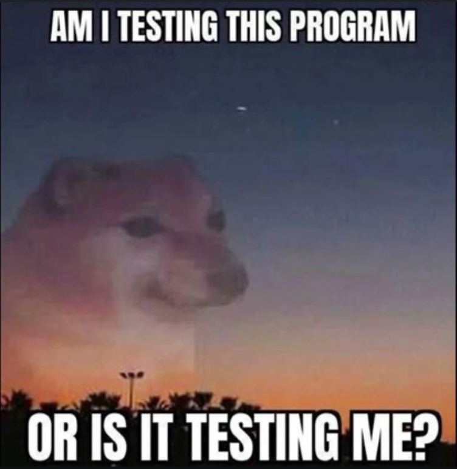

---
# Level 04 A
---

## Coding Philosophy: Remember to log!

Remember that `Console.WriteLine` is a function in C# that can print the value of variables to the console. It's really useful for quickly investigating problems with your program or just to see if it's working the way you intended.

```csharp
Console.WriteLine("test your code!");
Console.WriteLine(x); // print the value of a variable
```

---

## string.Split(separator)

strings have a lot of useful methods we can use. The Microsoft Documentation is a really great resource for learning C#. Documentation for the string class can be found here:

<https://learn.microsoft.com/en-us/dotnet/api/system.string.split?view=net-7.0#system-string-split(system-char())>

The string `Split` method splits a string by a pattern creating an array of strings.

```csharp
// split by ' ' to get an array of words
string[] arr = "the red fox".Split(' ');
// arr -> {"the", "red", "fox"}
```

---

# Level 04 B

---

## Lists

Lists are like arrays but they can change size. You can add and remove items from a list.

```csharp
List<string> names = new List<string> { "Amy", "Ellie", "Max" };
List<int> nums = new List<int> { 50, 21, 46, 83 };
```

You can even make empty lists that you can add items to later.

```csharp
List<string> todo = new List<string>();
```

---

## Adding to Lists

Use the `Add()` function to add elements to a list.

```csharp
names.Add("Jake"); // adds "Jake" to names list
// names -> {"Amy", "Ellie", "Max", "Jake"}

nums.Add(97); // adds 97 to the nums list
// nums -> {50, 21, 46, 83, 97}
```

---

## Converting a List to an Array

You can convert a List to an array using the `ToArray()` function.

```csharp
List<char> lettersList = new List<string> { 'a', 'b', 'c' };
char[] letters = lettersList.ToArray();
```

---

## Getting the length of a string

`Length` is used to get the number of items in a list and it can also be used to get the number of characters in a string.

## string.Join(separator)

The `string.Join` function creates a string by joining each element in the list together, inserting an optional separator string between each item.

```csharp
string[] names = new string[] { "Amy", "Ellie", "Max" };
string joined = string.Join(" ~ ", names);
// joined -> "Amy ~ Ellie ~ Max"
```

---

# Level 04 C

---

## Editing items in an List

Items in a List can also be edited using `[]` (aka index).

```csharp
names[2] = "Ben"; // edits the item at position 2 in the names list
// names -> {"Amy", "Ellie", "Ben"}

nums[1] = 4; // edits the item at position 1 in the nums list
// nums -> {50, 4, 42, 83}
```

---

## Accessing characters in a string

To access characters in a string you can use `[]` just like with accessing items in lists!

```csharp
string animal = "the red fox";
Console.WriteLine(animal[0]); // prints 't'
Console.WriteLine(animal[1]); // prints 'h'
Console.WriteLine(animal[4]); // prints 'r'
```

However, strings are immutable, meaning individual characters in the string can not be edited like you can with individual elements in a List.

```csharp
animal[8] = 'b'; // ERROR: won't change String to 'the red box'
animal = "the red box"; // this will work!
```

---

# Level 04 D

---

## Implied boolean conditions

In this example, if the boolean variable `gameOver` gets set to `true`, then tell the user "Game Over!".

```csharp
if (gameOver == true) {
	Console.WriteLine("Game Over!");
}
```

---

In C# you don't have to use `== true` in boolean conditions because checking for equivalence to `true` is implied. You can just put the variable in a boolean condition on it's own.

```csharp
if (gameOver) {
	Console.WriteLine('Game Over!');
}
```

---

You can use the not symbol `!` in front of booleans to check if something is not true.

```csharp
if (!isPlaying) {
	pause();
}
```

---

# End of Level 04

Sorry if you felt like this after testing your Hangman game!



---

## Computer History: Apple II

This level's computer was inspired by the Apple II. For many people in the US, the Apple II was the first computer they ever used at their home or school. Check out this video about it if you'd like!

<https://www.youtube.com/watch?v=CxJwy8NsXFs>

---
